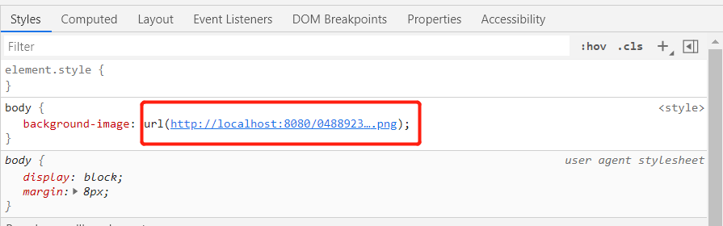
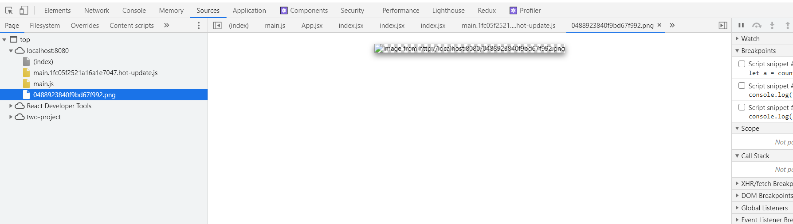

## webpack图片资源处理

### 现象

使用webpack5,编译打包css文件，在文件中引入背景图片，图片加载不出来

```css
//css代码
body{
	background-image: url(../img/test.png)
}
```

```js
//webpack.config.js
module:{
    rules: [
     {
        test:/\.(jpg|png|git)$/,
        use:{
          loader: 'url-loader',
        }
      }
    ]
},
```

查看浏览器,样式属性中引入了图片地址，但是图片无法预览（图片是一个base64字符串）





### 原因

查看webpack文档，发现资源模块（字体，图标等）无需配置二外loader，详情请查看[webpage资源模块](https://webpack.docschina.org/guides/asset-modules/)；

在 webpack 5 之前，通常使用：

- [`raw-loader`](https://v4.webpack.js.org/loaders/raw-loader/) 将文件导入为字符串
- [`url-loader`](https://v4.webpack.js.org/loaders/url-loader/) 将文件作为 data URI 内联到 bundle 中
- [`file-loader`](https://v4.webpack.js.org/loaders/file-loader/) 将文件发送到输出目录

资源模块类型(asset module type)，通过添加 4 种新的模块类型，来替换所有这些 loader：

- `asset/resource` 发送一个单独的文件并导出 URL。之前通过使用 `file-loader` 实现。
- `asset/inline` 导出一个资源的 data URI。之前通过使用 `url-loader` 实现。
- `asset/source` 导出资源的源代码。之前通过使用 `raw-loader` 实现。
- `asset` 在导出一个 data URI 和发送一个单独的文件之间自动选择。之前通过使用 `url-loader`，并且配置资源体积限制实现。

当在 webpack 5 中使用旧的 assets loader（如 `file-loader`/`url-loader`/`raw-loader` 等）和 asset 模块时，你可能想停止当前 asset 模块的处理，并再次启动处理，这可能会导致 asset 重复，你可以通过将 asset 模块的类型设置为 `'javascript/auto'` 来解决。

### 解决

```
//webpack.config.js
module:{
    rules: [
     {
        test:/\.(jpg|png|git)$/,
        type: 'asset/inline',  //通过webpack自带的模块类型，解决问题
      }
    ]
},
```

