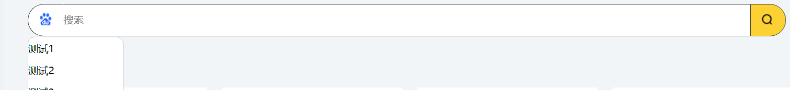

## 事件捕获和冒泡

### 问题现象

点击按钮，弹框显示，同时在document上绑定一个点击事件，该点击事件控制弹框关闭，当点击弹框外时，弹框关闭；

弹框内，数组存储数据，通过map循环展示在页面，点击可以删除历史记录；

删除数组前面的数据，弹框都时正常展示，但是当删除最后一个数据时，弹框关闭。




代码如下：

```jsx
import React, { useState, useEffect, useRef,useCallback } from "react";
import "./index.css";
export default function ({
  visible, //控制弹框状态
  close    //修改visible为false的方法
}) {
  const refSearchType = useRef(null);
  const [textData,setTextData] = useState(['测试1', '测试2', '测试3', '测试4', '测试5',])
  useEffect(()=>{
    if (visible) {
      document.addEventListener('click', judgeState)
    } else {
      document.removeEventListener('click', judgeState)
    }
  },[visible])

  const judgeState = useCallback((e) => {
    let tag = refSearchType.current.contains(e.target)
    if (!tag) {
      close()
    }
  },[])

  function onchange(item) {
    let data = textData.filter(it => it != item);
    setTextData(data)
  }

  return <div ref={refSearchType} className="searchTypeM" style={{display:visible?"":"none"}}>
    {textData.map((item,index)=>{
      return <div className="m-content" key={index} onClick={() => onchange(item)}> {item} </div>
    })}
  </div>
}
```

### 原因分析

当删除最后一个时，弹框关闭，可以看出，当前获取的元素在该组件中没有，所以触发了close()，那么可以看出，应该是**先触发了删除**，再触发判断元素是否在这个组件中的逻辑，那么问题就很简单，只要先判断，是否在该组件中，再删除，就可以了

但是：为什么删除数组前面几个数据时，没有问题呢，难道是，删除和判断两个任务，执行顺序不确定？

onClick是宏任务，谁先绑定，先触发，所以不存在执行顺序不确定，排除异步任务。

再看代码，发现key值用了index索引，原因明确了，因为删除后，key还存在，所以判断出了问题，其实元素已经删除。

### 解决

1、首先不再将索引赋值给key

2、先判断，再删除

```jsx
useEffect(()=>{
    if (visible) {
      document.addEventListener('click', judgeState, true)
    } else {
      document.removeEventListener('click', judgeState, true)
    }
  },[visible])
```

```jsx
return <div ref={refSearchType} className="searchTypeM" style={{display:visible?"":"none"}}>
    {textData.map( item =>{
      return <div className="m-content" key={item} onClick={() => onchange(item)}> {item} </div>
    })}
  </div>
```

### 总结

- 非必须情况下，不要将索引值作为key
- 灵活运用事件捕获，和事件冒泡

